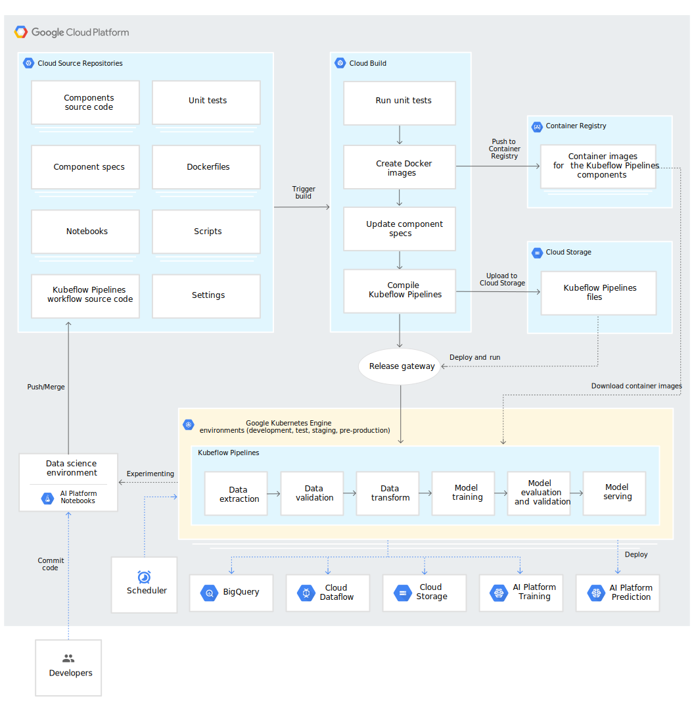

<!-- .slide: class="center" -->

# Kubeflow: Machine Learning in Kubernetes
##### Tristan Kosciuch
#### tkosciuch@cloudops.com

---

<!-- .slide: class="dark center" -->

# Machine Learning in Telcos

---

## Personalization of Users Based on Activity

  

User data is scattered all over the place in a big telco. 
OSS/BSS ML Algorithms can help predict usage patterns and recommend personalized
plans for different users.

---

## Customer Service and Retention

  

With complex customer base, customer service is becoming a challenge.
Technologies like Chatbots can be the first line of support to 
solve most of the common issues, while leaving the humans to deal
with outlier cases and improve overall customer satisfaction and retention.

---

## Security

  

Data is ingested in staggering quantities every day. ML algoritms can filter data ingests and detect malicious
content.

---

##  Network Optimization for Optimal Bandwidth Utilization

  

5G brings in a lot of challenges for moving data across networks. ML algorithms
can be used to predict network usage and find optimal network routes.
---

##  Efficient Edge Computing and the Internet of Things

  

Deciding what to leave in the cloud vs. what to compute at the edge is a complex problem. Deploying 
ML algorithms at the edge can filter data and reduce latency.

---

## Predictive Maintaince for Communication Equipment

  

Equipment maintenance is also a big problem in telcos. ML algorithms can help
identify potential faults before they happen based on the data that they collect
from various sensors.

 
**And more ...** <!-- .element: class="fragment" -->

---

<!-- .slide: class="dark center" -->

# Kubernetes & Machine Learning

---

## Kubernetes & Machine Learning
  
* Containers conveniently encapsulate all the dependencies required to run a machine learning job.  <!-- .element: class="fragment" -->
* Separation of concerns: Operations don't need to learn about ML in order to run an ML cluster.  <!-- .element: class="fragment" -->
* Kubernetes can chain containers to create a machine learning pipeline. <!-- .element: class="fragment" -->
* Trained models can run/upgraded/auto-scale easily. <!-- .element: class="fragment" -->
* Cloud Native: own your destiny in the cloud! <!-- .element: class="fragment" -->

---

<!-- .slide: class="dark center" -->

# Kubeflow

---

## Kubeflow

  

> Kubeflow is a composable, portable, and scalable ML stack built on top of Kubernetes. It
> provides an open source platform for ML models to attach themselves to
> containers. <!-- .element: class="fragment" -->

Run Argo workflows (pipelines) from CLI or Jupyter notebooks and easily implement hyperparameter 
tuning and/or neural architecture search in a production environment. <!-- .element: class="fragment" -->

---
## Kubeflow Experimention Phase

and Caffe and MPI.
---

## Kubeflow Production Phase

---
<!-- .slide: class="dark center" -->

# Kubeflow provides the following tools to enable Machine learning on Kubernetes

---

## Kubeflow Pipelines
   

Kubeflow pipelines are reusable end-to-end ML workflows built using the
Kubeflow Pipelines SDK directly or with Kale in JupyterLab. They allow you to compose, deploy and manage machine
learning workflows.

---
## Kubeflow Pipelines
   

* Use Argo under the hood.
* At the basic level, it is made of components: <code>mytask.py</code> and <code>mytask</code> directory in a docker container.
* Recurring or non-recurring, can set up run triggers such as a merge on Git.

---
## Kubeflow Pipelines and GCP

On GCP Kubeflow can trigger pipelines:

 * Using Cloud Scheduler.
 * In response to events using Pub/Sub and Cloud Functions.
 * Through custom workflows using Cloud Composer or Cloud Data Fusion.

---

## Kubeflow Pipelines and GCP

---

## Machine Learning & Production

Kubeflow pipelines uses Argo as a backend, and Argo Events can be triggered from the following sources:

---

## JupyterHub
    

JupyterHub allows you to create Jupyter Notebooks which are a collaborative
and interactive way of developing ML models. They support both
Markdown for inline docs, plotting graphs and images.

---
## Kale and JupyterLab
    

Kale is a Python package that deploys pipelines from Jupyter Notebooks. Users
decide which Notebook cells correspond to which pipeline steps by the use of tags.

---
## TensorFlow Model Analysis

   

Python library for evaluation Tensorflow models. Compute metrics over "slices" of data to better understand model performance.

---

## Katib

   

Katib is a hyperparameter tuning framework and is tightly
integrated with k8s. It provides hyperparameter tuning and neural architecture search (NAS). NAS is currently in 
alpha.

---
<!-- .slide: class="light center" -->

# Workshop

* Intro to Katib and Katib formatting.
* Demo of NAS.
* Data science in Jupyter Notebooks.
* Build and deploy a pipeline with Kale.

---
<!-- .slide: class="dark center" -->

# Questions?
### Find out more at http://kubeflow.org
### Reach out to me at:  <a href="mailto:tkosciuch@cloudops.com">tkosciuch@cloudops.com</a> <a href="http://github.com/TristansCloud">github.com/TristansCloud</a>
