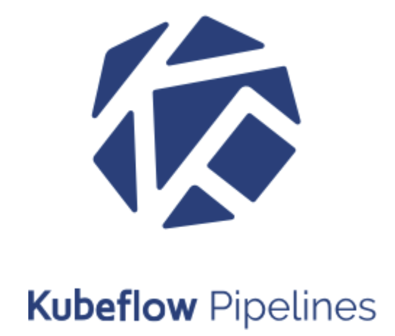

<!-- .slide: class="center" -->

# Kubeflow: Machine Learning in Kubernetes
##### Syed Ahmed
#### sahmed@cloudops.com

---

<!-- .slide: class="dark center" -->

# Machine Learning in Telcos

---

## Personalization of Users Based on Activity 

  

User data is scattered all over in a big telco. ERP systems OSS/BSS
ML Algorithms can help in predicting usage patters and recommend personalized
plans for different users

---

## Customer Service and Retention

  

With growing customer base, customer service is becoming a challenge.
Technologies like Chatbots can be the first line of support for customers
which can solve most of the common issues while leaving the humans to deal
with outlier cases improving overall customer satisfaction and retention

---

##  Network Optimization for Optimal Bandwidth Utilization

  

5G brings in lot of challenges for moving data across. ML algorithms
can be used to predict network usage find optimal routes and detect malicious
content

---

## Predictive Maintaince for Communication Equipment 

  

Equipment maintenance is also a big problem in telcos, ML algorithms can help
identify potential faults before they happen based on the data that they collect
from various sensors

 
**And more ...** <!-- .element: class="fragment" -->

---

<!-- .slide: class="dark center" -->

# Kubernetes & Machine Learning

---

## Kubernetes & Machine Learning

* Kubernetes lends itself very well to run production grade machine learning workloads <!-- .element: class="fragment" -->
* Containers conveniently encapsulate all the dependencies required to run a machine learning job  <!-- .element: class="fragment" -->
* Separation of concerns: Operations don't need to learn about ML in order to run an ML Cluster  <!-- .element: class="fragment" -->
* Kubernetes can chain containers to create a machine learning pipeline <!-- .element: class="fragment" -->
* Trained models can be run/upgraded/auto-scale easily <!-- .element: class="fragment" -->

---

<!-- .slide: class="dark center" -->

# Kubeflow

---

## Kubeflow

> Kubeflow is a composable, portable, and scalable ML stack built on top of Kubernetes. It
> provides an open source platform for ML models to attach themselves to
> containers, performing computations alongside the data instead of within a
> superimposed layer. 

**Kubeflow provides the following tools to enable Machine learning on Kubernetes:**

---
## Tensorflow
   

TensorFlow is an open-source machine learning framework from Google. It
provides easy to use APIs for creating, training and serving deep learning
models.

---
## JupyterHub
    

JupyterHub allows you to create Jupyter Notebooks which are a collaborative
and interactive way of developing machine learning models. They support both
Markdown for inline docs, plotting graphs and images.

---
## TFJob and Dashboard

<pre><code>

apiVersion: kubeflow.org/v1alpha2
kind: TFJob
metadata:
  name: example-tfjob
spec:
  tfReplicaSpecs:
    MASTER:
      replicas: 1
      template:
        spec:
          containers:
            - image: syed/tf-mnist:gpu
              name: tensorflow
              resources:
                limits:
                  nvidia.com/gpu: 1
          restartPolicy: OnFailure

</code></pre>

    
Kubeflow provides custom resource definition (CRDs) that makes it easy to run
distributed or non-distributed TensorFlow jobs on Kubernetes.  It also allows
you to specify resources like GPUs or TPUs.

---
## Katib hyperparameter tuning framework

   

Katib is a cross framework, scalable and flexible hyperparameter tuning framework and is tightly
integrated with kubernetes.

---
## Model Serving

   

Kubeflow provides a TensorFlow serving container to expose trained TensorFlow
models in a RESTful way. It also integrates with Seldon Core, an open source
platform for deploying machine learning models on Kubernetes, and NVIDIA
TensorRT Inference Server.

---
## ML Pipelines (latest addition)
   

Kubeflow pipelines are reusable end-to-end ML workflows built using the
Kubeflow Pipelines SDK. They allow you to compose, deploy and managed machine
learning workflows.

---
<!-- .slide: class="dark center" -->

# Demo

---
## Demo

---
## Demo

* [Chicago taxi cabs dataset](https://data.cityofchicago.org/widgets/wrvz-psew)
* Given starting location, destination location & time estimate the total fare
* 1000 Training samples, 5000 evaluation samples
* Using TensorFlow Extended (TFX)
* Create a ML Pipeline with the following steps
    * Validation of data using **Tensorflow Data Validation (TFDV)**
    * Transformation of data using **Tensorflow Transform (TFT)**
    * Train the model using **Tensorflow**
    * Evaluate the model using **Tensorflow Model Analysis (TFMA)**
    * Deploy the model using **Tensorflow Serving**

---
<!-- .slide: class="dark center" -->

# Questions?
### Find out more at http://kubeflow.org
